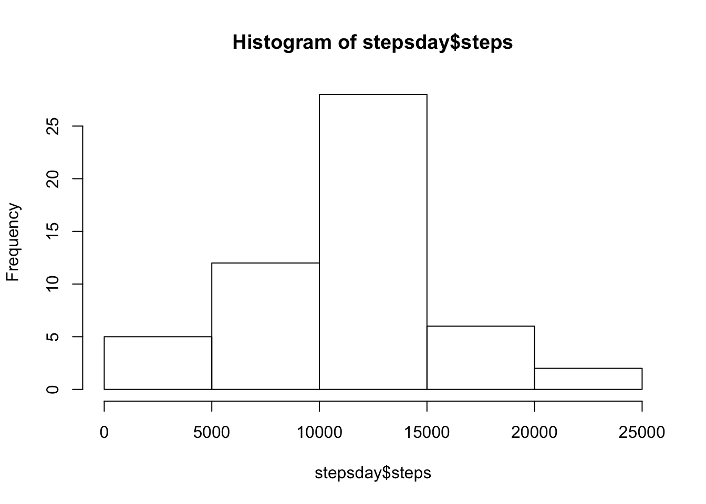
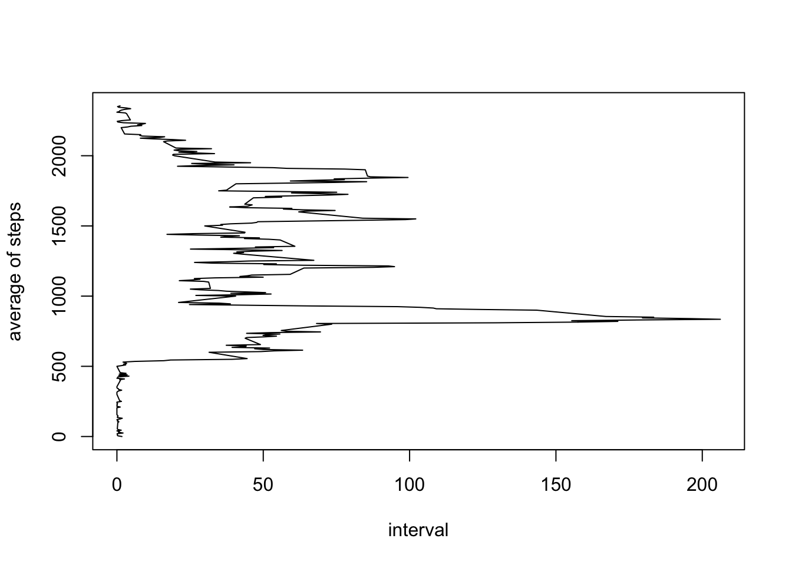
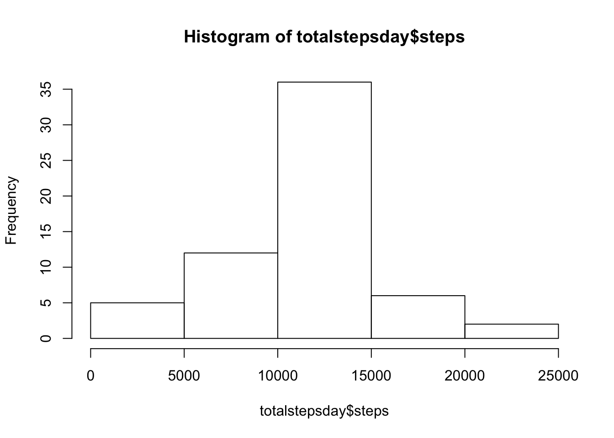
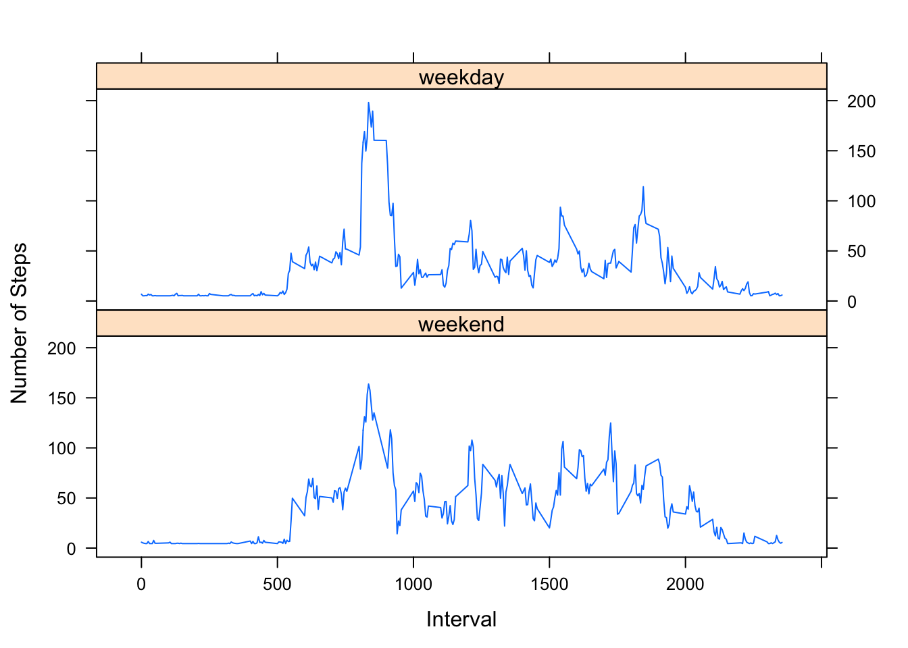

## Loading and preprocessing the data
First we load the data

```r
unzip("activity.zip")
data <- read.csv("activity.csv")
```
And then we process it to see the steps per day 

```r
stepsday<-aggregate(steps~date, data,sum,na.rm=TRUE)
```

## What is mean total number of steps taken per day?
This is a histogram of the steps per day without the NAs


```r
hist(stepsday$steps)
```




```r
meantotal <-mean(stepsday$steps)
mediantotal <-median(stepsday$steps)
```

The mean of total number of steps taken per day is 1.0766189\times 10^{4}

The median of total number of steps taken per day is 10765

## What is the average daily activity pattern?

Make a time series plot (i.e. type = "l") of the 5-minute interval (x-axis) and the average number of steps taken, averaged across all days (y-axis)


```r
ave<-aggregate(steps~interval, data,mean,na.rm=T)
```


```r
plot(ave$steps,ave$interval, type="l", xlab="interval", ylab = "average of steps")
```



Which 5-minute interval, on average across all the days in the dataset, contains the maximum number of steps?


```r
max(ave$steps)
```

```
## [1] 206.1698
```

## Imputing missing values

Calculate and report the total number of missing values in the dataset (i.e. the total number of rows with NAs)

```r
numeroNAS <-sum(is.na(data$steps))
```
The total number of rows with NAs is 2304

Devise a strategy for filling in all of the missing values in the dataset. The strategy does not need to be sophisticated. For example, you could use the mean/median for that day, or the mean for that 5-minute interval, etc.

```r
replace_missings<-function(x,replacement){
    is_miss<-is.na(x)
    x[is_miss]<-replacement
    x
}
```

Create a new dataset that is equal to the original dataset but with the missing data filled in.


```r
data1<-replace_missings(data,mean(ave$steps))
```

Make a histogram of the total number of steps taken each day and Calculate and report the mean and median total number of steps taken per day. 

```r
totalstepsday<-aggregate(steps~date, data1,sum)
hist(totalstepsday$steps)
```




Do these values differ from the estimates from the first part of the assignment? What is the impact of imputing missing data on the estimates of the total daily number of steps?

```r
mean(totalstepsday$steps)
```

```
## [1] 10766.19
```

```r
median(totalstepsday$steps)
```

```
## [1] 10766.19
```

## Are there differences in activity patterns between weekdays and weekends?

For this part the weekdays() function may be of some help here. Use the dataset with the filled-in missing values for this part.

*Create a new factor variable in the dataset with two levels -- "weekday" and "weekend" indicating whether a given date is a weekday or weekend day.


```r
data1$date <- as.Date(data1$date)
weekdays1 <- c('lunes', 'martes', 'miercoles', 'jueves', 'viernes')
data1$WeekDay <- factor((weekdays(data1$date) %in% weekdays1), 
                   levels=c(FALSE, TRUE), labels=c('weekend', 'weekday') 
)
```

*Make a panel plot containing a time series plot (i.e. type = "l") of the 5-minute interval (x-axis) and the average number of steps taken, averaged across all weekday days or weekend days (y-axis). 

First i create the average data for weekday and weekend days

```r
caldata<-aggregate(steps~interval+WeekDay, data1,mean,na.rm=T)
```

And the plot

```r
library(lattice)
xyplot(steps~interval|WeekDay, data=caldata, layout=c(1,2), type="l", xlab="Interval", ylab="Number of Steps")
```


